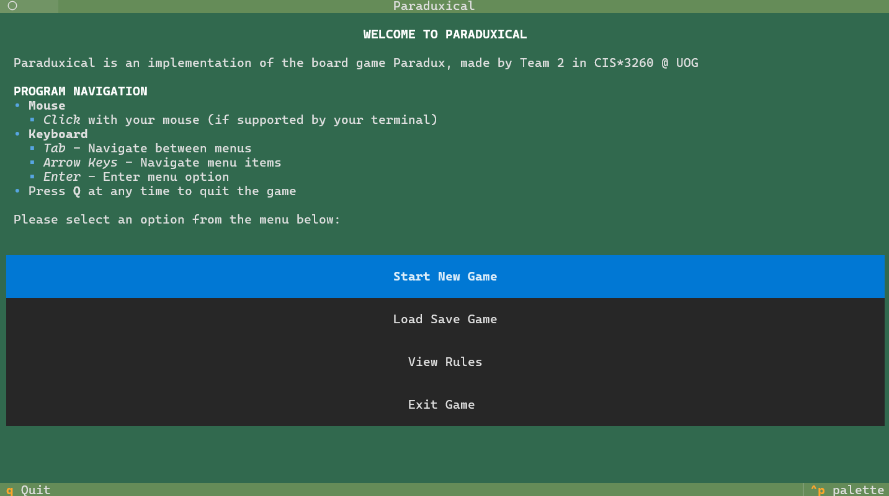
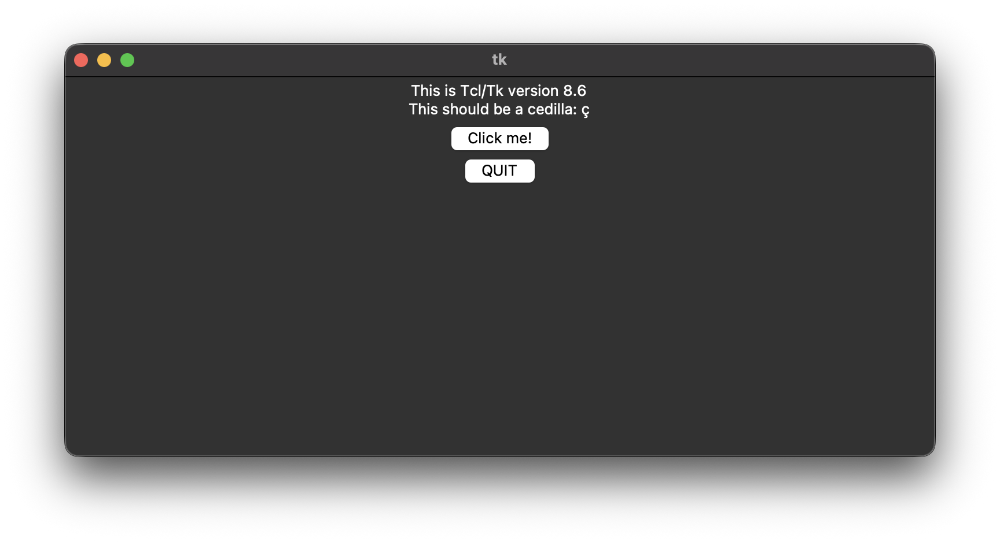
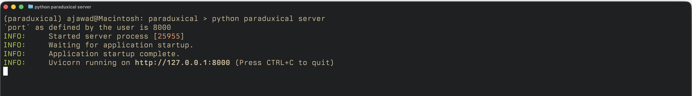
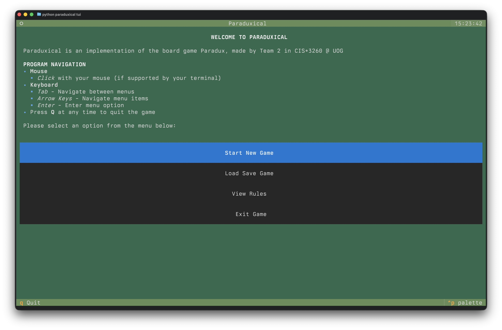
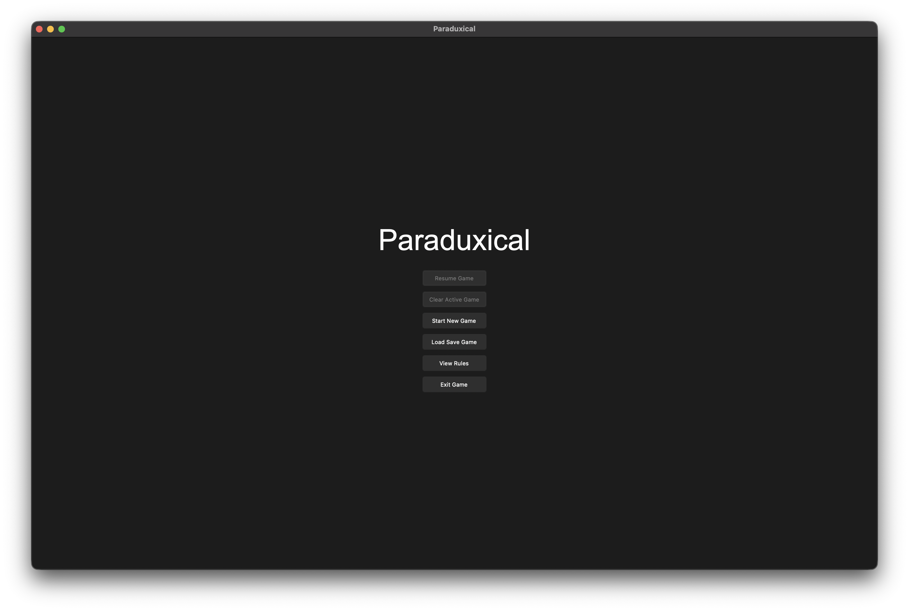

# Paraduxical



## Table of Contents

- [Game Summary](#game-summary)
- [Installation Instructions](#installation-instructions)
  - [Setup](#setup)
    - [Creating Virtual Environment](#creating-virtual-environment)
    - [Activating Virtual Environment](#activating-virtual-environment)
    - [Deactivating Virtual Environment](#deactivating-virtual-environment)
    - [Installing Dependencies](#installing-dependencies)
  - [Requirements](#requirements)
  - [Running the Game](#running-the-game)
- [Demo](#demo)
  - [Game Demo](#game-demo)
  - [SOCS Server Install Video](#socs-server-install-video)
- [Contacts](#contacts)
- [License](#license)

## Game Summary

Paraduxical is an implementation of the board game Paradux, made by Team 2 in CIS*3260 @ UOG.

The game is played on a hexagonal board, and each turn a player selects one of their own tokens and an adjacent token belonging to the opposing player and either swaps their positions, or shifts them in an open direction.

The objective is to be the first player to line up FOUR of your tokens in a row, horizontally or diagonally.

## Installation Instructions

### Setup

Python uses virtual environments to manage Python project libraries and frameworks, such as those that come from outside the Python standard library.
Our project/game uses the: (1) open-source **textual** terminal user interface (TUI) framework to build its TUI, (2) Python **tkinter** standard library package to build its graphical user interface (GUI), and (3) **FastAPI** to build its web application processing interface (API).
As such, **textual**, **tkinter**, and **FastAPI** are dependencies that are required by our project to function correctly.
Since our project uses dependencies, we must abide by Python's rules for managing dependencies.

**textual**, **tkinter**, and **FastAPIs** are Python projects with their own set of dependencies, and so these dependencies must be installed for our project to function.
Dependencies of our dependencies are referred to as **indirect dependencies**, whereas dependencies that are explictly imported by our project are referred to as **direct dependencies**.
Python is smart in that it is able to find and install all of a project's **indirect dependencies** in-order for the **direct dependencies** of a project to function correctly.
Thus, virtual environments and **requirements.txt** files are necessary to allow our Python projects to function correctly.

The rest of the setup section of this document will describe how to:

- Create, activate, and deactivate Python virtual environments
- Install all the project dependencies within a Python virtual environment

#### Creating Virtual Environment

From the project's root directory, run the command below:
`python3 -m venv .venv`

This command below will use Python's virtual environment module to create a new virtual environment, called **.venv** in our project's root directory.
This new virtual environment will contain all of our project's dependencies, and will be fully isolated from other Python virtual environments.

#### Activating Virtual Environment

From the project's root directory, run the following commands:

- Windows: `.venv/Scripts/activate.bat`
- Apple Macintosh or GNU/Linux: `source .venv/bin/activate`

Windows has a different syntax than Macintosh or GNU/Linux because it uses PowerShell, and is not a UNIX-based operating system.
Macintosh and GNU/Linux use the same syntax because they use similar default shells: `zsh` for Macintosh and `bash` for GNU/Linux, and they are both UNIX-based operating systems.
The same concept applies to deactivating the virtual environments, which are described next.

#### Deactivating Virtual Environment

From the project's root directory, run the following commands:

- Windows: `.venv/Scripts/deactivate.bat`
- Apple Macintosh or GNU/Linux: `deactivate`

Note: you actually do not need to run the `deactivate` command from the root directory of the project on Macintosh or GNU/Linux because the `deactivate` command is path-agonstic.
We can execute this command anywhere from within the virtual environment, and there will be no need to provide a path argument to it.
However, Windows still requires you to execute the virtual environment deactivation program from a specific directory, so you must be at the project root to correctly execute the Windows command.

#### Installing Dependencies

From the project root, run the following command to install all the dependencies required to run the game:

```sh
pip install -r requirements.txt
```

**Notes:**

- The **requirements.txt** file is a simply formatted text file that Python uses to find and install all the dependencies of a project, and even allows the developer to specify the precise versions of the dependencies to install.
- This command installs all the dependencies of the game only in the virtual environment you are in now.
  - You will not have access to the same dependencies installed now if you create and use another virtual environment.
  - Python manages virtual environments by isolating them from one another, which means no installed packages from one virtual environment can be shared with another.

### Requirements

- **Python** versions 3.11-3.12
  - These specific versions of Python are selected because **tkinter** has to be locked at version 8.6 for the project to work, which is easily installable with Python versions 3.11 to 3.12.
    - From our internal testing, using a newer version of Python, like `python3.14`, forces **tkinter** to be upgraded to version 9, which is not going to work with our current project's GUI implementation and usage of **tkinter**.
- **textual** framework version 6.5 or higher
- **tkinter** version 8.6
- **FastAPI** version 0.122.0

### Running the Game

Before running the game, refer to the [Setup](#setup) section described prior for creating and activating Python virtual environments, and installing dependencies in them.

First, you must have already successfully created and activated a Python virtual environment.
To make sure that you are inside an activated Python virtual environment, you should see a similar command prompt like the following:

```sh
(.venv) ajawad@linux-01:~/CIS3260/team-project/m2/paraduxical$
```

Notes about the prompt:

- The most important part of this prompt is the `(.venv)` prefix to the rest of the prompt: `ajawad@linux-01:~/CIS3260/team-project/m2/paraduxical$`.
- The `(.venv)` prefix indicates that you are inside a Python virtual environment, if you were following the instructions in [Setup](#setup) correctly.
- This is a good sign that you are ready to ensure that you have all the required dependencies in your virtual environment to play the game.
- The rest of the prompt: `ajawad@linux-01:~/CIS3260/team-project/m2/paraduxical$` is not important because you will likely have a different username, hostname, and working directory.
- If you do not have `(.venv)` as a prefix in your prompt, then you must refer to the steps described in the [Setup](#setup) section to correctly create and activate a Python virtual environment.

Second, you must verify that you have installed all dependencies that the project requires in your Python virtual environment. To do so, run the following command:

```sh
pip freeze
```

Notes about the `pip freeze` command:

- This command will get `pip` (i.e., the Python package manager) to list all the installed packages in the current Python virtual environment.
- This step is important because it will tell you whether you have all the required packages for the project installed.
- Without any of or all the required packages for the project, you will be unable to run the game.
  - Python will likely throw an exception about missing packages in this case, and so you must solve the missing dependencies problem first.

You should see the following output from the `pip freeze` command if you followed the [Setup](#setup) steps correctly:

```txt
aiohappyeyeballs==2.6.1
aiohttp==3.13.2
aiohttp-jinja2==1.6
aiosignal==1.4.0
annotated-doc==0.0.4
annotated-types==0.7.0
anyio==4.11.0
attrs==25.4.0
certifi==2025.11.12
charset-normalizer==3.4.4
click==8.3.0
fastapi==0.122.0
frozenlist==1.8.0
h11==0.16.0
idna==3.11
jinja2==3.1.6
linkify-it-py==2.0.3
markdown==3.10
markdown-it-py==4.0.0
markupsafe==3.0.3
mdit-py-plugins==0.5.0
mdurl==0.1.2
msgpack==1.1.2
multidict==6.7.0
pillow==10.4.0
platformdirs==4.5.0
propcache==0.4.1
pydantic==2.12.5
pydantic-core==2.41.5
pygments==2.19.2
requests==2.32.5
rich==14.2.0
sniffio==1.3.1
starlette==0.50.0
textual==6.5.0
textual-dev==1.8.0
textual-serve==1.1.3
tkhtmlview==0.3.1
typing-extensions==4.15.0
typing-inspection==0.4.2
uc-micro-py==1.0.3
urllib3==2.5.0
uvicorn==0.38.0
websockets==15.0.1
yarl==1.22.0
```

Notes about the output of the `pip freeze` command:
- The output of the `pip freeze` command will list all the installed packages in the current Python environment.
- Since you should be inside a Python virtual environment, you will see all the installed packages within the currently activated Python virtual environment.
- You must ensure that you have all the packages listed in the sample output of the `pip freeze` command.
  - The precise version numbers for each package may differ in your case, so different version numbers for the packages should be okay so long as they are not major version changes.
- If there are discrepancies between the output of your `pip freeze` command and the one listed above, you may: (1) be in the wrong Python virtual environment, or (2) have not installed all the required dependencies of the project according to the [Setup](#setup) section in your virtual environment.
  - If this is the case, you need to review the instructions in the [Setup](#setup) section again, and follow them closely.

#### Note on tkinter and Python versions
**tkinter** is an optional Python standard library module, so it may not be installed with your compute environment's Python installation.
To check that you have **tkinter** installed with your compute environment's Python installation, run the `python -m tkinter` command.
If the output looks similar to the basic GUI interface captured in the image below, especially if it states that you have version 8.6 of **tkinter** installed, then you are good to go.



If you do not have **tkinter** or the right version of it installed, then you will need to install it via your default system package manager.
On the School of Computer Science (SoCS) GNU/Linux servers, **tkinter** version 8.6 is installed by default to all users, so you need not do anything to get it to install or work. 
However, if you are on a different GNU/Linux compute environment, you may need to install Python's **tkinter** optional module manually via the system package manager.
Before you go any further, you must make sure that **tkinter** version 8.6 is installed in your compute environment because the project will not work otherwise.

Once you have verified that the packages necessary to run the project have been installed, you can run the game application via the following 3 simple commands:

First, start the server so that the GUI and TUI can communicate with one another:
```sh
python paraduxical server
```
Notes on this command:
  - This command starts the game server on **port 8000** by default, which means that any communication the GUI and TUI clients have with the server happens on that port specifically.
    - We recommend using the default **port 8000** to make using the command-line interface (CLI) of the project easy and error-free, however you may choose to use your own ports, which we do support.
  - If you want to use a different port, you can use the same command, but pass the `-p` or `--port` switches with their numerical port numbers to the command, like so: `python paraduxical server -p <port_num>`.
    - Note that we do not provide in-depth error handling on whether the port you provide is actually open or not, so you need to make sure that the port number you provide actually refers to an open port or not.
    - If you do decide to use a different port than the default **port 8000**, then you must also make sure that you use the same port number for the **tui** and **gui** client commands that will be discussed later.
      - Again, we do not provide in-depth error handling to make sure that the port numbers that you provide for the subsequent **tui** and **gui** client commands are actually consistent with what you provided the **server** command with. So, you must make sure that the port number you provided is consistent or the same across the **server**, **tui**, and **gui** commands.

If this command was successful, you should see a series of `INFO:` server log statements show up, like in the image below:



Also, note the following: the **port** is **8000** because we did not specify our own custom port, which we recommend to avoid the complexity of having to make sure your ports for the CLI commands of **tui** and **gui** match the **server** CLI command.

Second, on a seperate shell instance, start the **tui** client so that you can get the **tui** of the game to play it:
```sh
python paraduxical tui
```
Notes on this command:
  - This command will start the start the game's **tui** client, and it will use **port 8000** to communicate with the server so that it can stay in-sync with the game's GUI.
  - If you wish to use your own port for this command, run the following modified command: `python paraduxical tui -p <port_num_from_server_command_earlier>`.
    - As before, you need to make sure that the port you provide is identical to the one for the `server` command from earlier and your provided port from the `server` command is open or available to use. 

If this command was successful, you should now be within the game application that is running within your terminal window, and you should see a user interface like so:



The precise color scheme of your **tui** may be different based on the terminal environment you have, but the overall UI layout and feel should be identical.

Third, on a distinct shell instance, start the **gui** client so that you can play the game from a **gui**:
```sh
python paraduxical gui
```
Notes on this command:
  - This command will start a new instance of the game's GUI using Python's **tkinter** library, and it also uses **port 8000** to communicate with the server to stay in-sync with the game's TUI.
  - Should you want to have your GUI communicate with the server on the custom port you chose for the server, you need to run the following command: `python paraduxical gui -p <port_num_from_server_command_earlier>`.
    - As before, you have to make sure the port you provide to the **gui** command is identical to the one for the **server** command and is open/ready-for-use on your compute environment.

If successful, you should see and be able to use the following GUI of the game application:



You are ready to play the game now! See the [Game Demo](#game-demo) section below for a visual demonstration of how this process works, and how to play the game.

## Demo

### Game Demo


## Contacts

- Ali Riayde Jawad
  - [GitHub](https://github.com/ariaydejawad)
  - [GitLab](https://gitlab.socs.uoguelph.ca/ajawad)
- Derek Duong
- Michael Janeway
  - [itch.io](https://happyfacemike.itch.io/)
  - [GitHub](https://github.com/michaeljaneway)
  - [LinkedIn](https://www.linkedin.com/in/michael-janeway/)
- Ryan Nguyen

## License

This project uses the [MIT](https://mit-license.org/) license.
